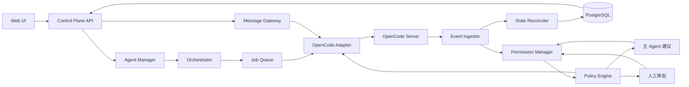
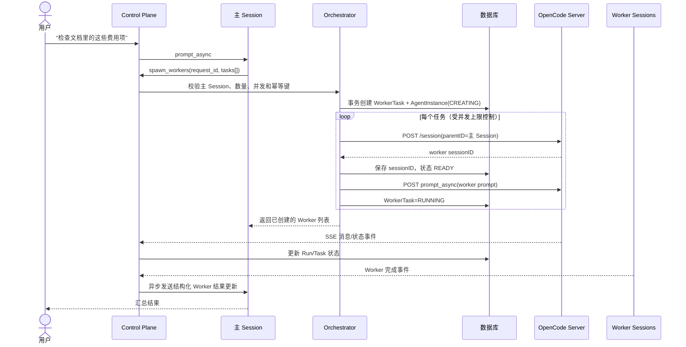
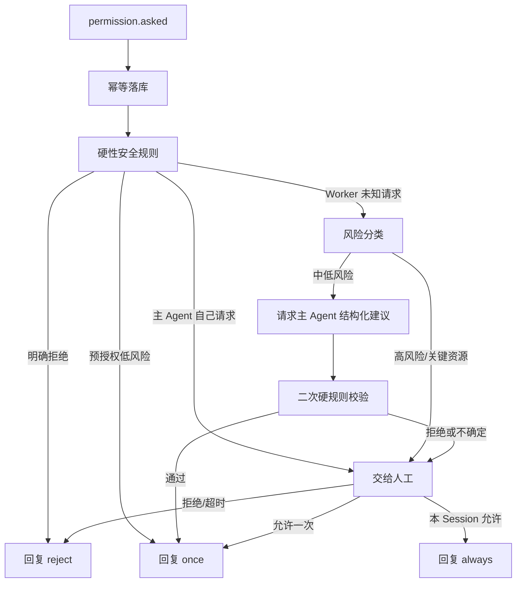
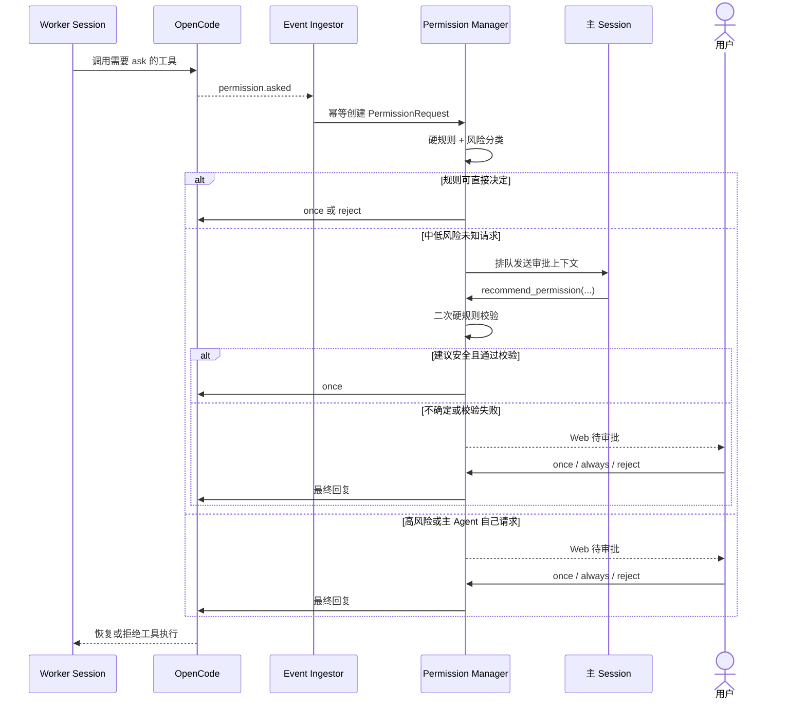

# OpenCode Control Plane：后端设计稿（MVP）

> 目标：让一个“主 Agent”管理多个彼此独立、可单独对话的 OpenCode Worker Session，并由后端统一处理任务编排、状态同步和权限审批。
>
> 文档日期：2026-08-17。接口以 OpenCode 当日官方文档、官方 SDK/源码为依据；部署时仍须对实际安装版本做能力探测。

本机已发现 Homebrew 安装的 OpenCode `1.17.15`。对该二进制做只读检查后，确认它同时包含传统 Session/事件/权限路由与 v2 Permission 路由，包括 `/session/status`、`/session/{sessionID}/prompt_async`、`/event`、`/global/event`、`/api/permission/request` 和 `/api/session/{sessionID}/permission/{requestID}/reply`。因此 Adapter + 启动能力探测不是预防性过度设计，而是当前本机版本确实需要的兼容边界。

## 1. 先给结论

第一版采用以下边界：

- 一个逻辑 Agent 对应一个独立 OpenCode Session。
- 主 Agent 与 Worker 的关系同时记录在本系统数据库；创建 Worker 时也尽量把主 Session ID 作为 OpenCode `parentID` 传入，但本系统数据库是关系的唯一可信来源。
- OpenCode 负责模型上下文、工具调用与会话历史；Control Plane 负责团队关系、任务编排、权限路由、审计与面向 Web 的统一状态。
- 主 Agent 不能直接调用 OpenCode 的权限回复接口。它只能给出结构化建议，真正批准/拒绝的是 Permission Manager。
- 业务层不能直接依赖某一组 OpenCode URL。所有调用经过 `OpenCodeAdapter`，启动时读取 `/global/health` 与 `/doc`，识别实际版本和可用路由。
- MVP 先采用“一个固定工作区 + 一个 OpenCode Server + 多个 Session”；并发改代码暂不做，Worker 主要执行读取、查询与分析。

## 2. 已核实的 OpenCode 能力

### 2.1 当前公开、适合 MVP 使用的接口

| 能力 | 当前公开接口 | 后端用途 |
|---|---|---|
| 健康与版本 | `GET /global/health` | 启动检查、记录 OpenCode 版本 |
| OpenAPI 规范 | `GET /doc` | 能力探测、兼容不同版本 |
| 创建 Session | `POST /session`，body 支持 `parentID?`、`title?` | 创建主 Agent 和 Worker |
| 查询子 Session | `GET /session/:id/children` | 对账用，不作为唯一关系来源 |
| Session 状态 | `GET /session/status` | 重连后的状态校准 |
| 中止 Session | `POST /session/:id/abort` | 停止当前运行 |
| 删除 Session | `DELETE /session/:id` | 显式清理，不等同于中止 |
| 消息历史 | `GET /session/:id/message` | 打开聊天窗口时加载完整历史 |
| 同步消息 | `POST /session/:id/message` | 需要等待结果的内部调用 |
| 异步消息 | `POST /session/:id/prompt_async` | 并行启动 Worker，立即返回 204 |
| 事件流 | `GET /event`，另有 `GET /global/event` | 实时接收消息、状态、权限事件 |
| 权限回复 | 传统 `/session/:id/permissions/:permissionID`；v2 另有 `/api/session/:sessionID/permission/:requestID/reply` | 由 Adapter 根据能力探测选择 |

### 2.2 不能直接照搬旧设计的地方

1. OpenCode 的 Session 状态只有：
   - `busy`
   - `retry`
   - `idle`

   它没有原生 `WAITING_APPROVAL` 或 `COMPLETED`。这两个状态必须由 Control Plane 推导。

2. OpenCode 正在演进 v2 API：
   - 传统路由主要是 `/session/*`、`/event`。
   - 新协议中存在 `/api/session/*`、Session 专属 SSE、按 Location 查询待审批请求等实验性路由。
   - 第一版以实际 `/doc` 为准，通过 Adapter 屏蔽差异，不能把实验性路由散落到业务代码中。

3. SSE 不能被当成唯一事实来源：
   - 断线期间可能漏事件。
   - 后端重启后必须重新查询 Session 状态、待处理权限和消息历史进行校准。

4. `idle` 不等于业务任务完成：
   - 新建但未运行的 Session 也可能是 idle。
   - 一次回复结束后 Session 是 idle，但它仍可继续聊天。
   - 因此“完成”属于一次 `AgentRun`，不是整个 `AgentInstance`。

## 3. 总体架构



模块职责：

- `Agent Manager`：维护主/子逻辑关系与 Agent 生命周期。
- `Message Gateway`：把 Web 消息映射到正确 Session；避免前端直接访问 OpenCode。
- `Orchestrator`：验证并执行 `spawn_workers`、通知主 Agent 子任务状态、控制并发。
- `OpenCodeAdapter`：OpenCode SDK/HTTP 的唯一入口，隐藏 v1/v2 差异。
- `Event Ingestor`：消费 SSE，转换为本系统事件。
- `State Reconciler`：断线或重启后主动对账，恢复正确状态。
- `Permission Manager`：记录请求、风险分类、路由建议/人工、最终回复 OpenCode。
- `Policy Engine`：确定允许、拒绝、请求主 Agent 建议或请求人工。

## 4. OpenCode Adapter 合同

业务层只依赖下面的内部接口，不直接依赖 OpenCode URL：

```ts
interface OpenCodeAdapter {
  probeCapabilities(): Promise<OpenCodeCapabilities>

  createSession(input: {
    title: string
    parentSessionId?: string
    directory: string
    agent?: string
    model?: { providerID: string; modelID: string }
    permission?: unknown
  }): Promise<{ sessionId: string }>

  getSession(sessionId: string): Promise<OpenCodeSession>
  listChildren(sessionId: string): Promise<OpenCodeSession[]>
  getStatuses(): Promise<Record<string, "busy" | "retry" | "idle">>

  sendAsync(sessionId: string, message: OpenCodePrompt): Promise<void>
  sendAndWait(sessionId: string, message: OpenCodePrompt): Promise<OpenCodeMessage>
  listMessages(sessionId: string, cursor?: string): Promise<OpenCodeMessage[]>

  abortSession(sessionId: string): Promise<void>
  deleteSession(sessionId: string): Promise<void>

  subscribeEvents(onEvent: (event: OpenCodeEvent) => Promise<void>): Promise<Closeable>
  listPendingPermissions(scope?: { sessionId?: string }): Promise<OpenCodePermission[]>
  replyPermission(input: {
    sessionId: string
    permissionId: string
    decision: "once" | "always" | "reject"
    message?: string
  }): Promise<void>
}
```

`probeCapabilities()` 的启动流程：

1. 调用 `/global/health`，保存版本号。
2. 获取 `/doc` OpenAPI。
3. 检查 Session、异步消息、事件、权限列表与权限回复路由。
4. 生成内存中的 `OpenCodeCapabilities`。
5. 缺少关键能力时阻止服务进入 Ready，而不是运行到一半才失败。

## 5. 数据模型

### 5.1 `task_group`

表示一次“批量排查团队”。

| 字段 | 说明 |
|---|---|
| `id` | UUID |
| `title` | 例如“8 月商品损益对比” |
| `workspace_path` | OpenCode 工作目录 |
| `root_agent_id` | 主 Agent ID，创建后回填 |
| `status` | `CREATING/RUNNING/NEEDS_ATTENTION/COMPLETED/FAILED/CANCELLED` |
| `created_by` | 用户 ID |
| `created_at/updated_at` | 时间戳 |

### 5.2 `agent_instance`

表示一个逻辑 Agent，并映射到一个 OpenCode Session。

| 字段 | 说明 |
|---|---|
| `id` | UUID |
| `task_group_id` | 所属团队 |
| `parent_agent_id` | 主 Agent为空；Worker 指向主 Agent |
| `role` | `MAIN/WORKER` |
| `name` | 例如“广告费” |
| `opencode_session_id` | 唯一索引 |
| `lifecycle_status` | `CREATING/READY/RUNNING/WAITING_APPROVAL/WAITING_INPUT/IDLE/FAILED/CANCELLED/DELETED` |
| `last_error` | 最近错误 |
| `created_at/updated_at` | 时间戳 |

约束：同一 `task_group` 只能有一个 `MAIN`。

### 5.3 `worker_task`

表示主 Agent 拆出的一个业务任务。

| 字段 | 说明 |
|---|---|
| `id` | UUID |
| `task_group_id` | 所属团队 |
| `worker_agent_id` | 对应 Worker |
| `idempotency_key` | 防止主 Agent 重复调用工具创建两次 |
| `field_key` | 费用项稳定标识 |
| `title` | 费用项显示名 |
| `prompt` | 给 Worker 的完整任务 |
| `source_refs` | 钉钉文档等来源，JSONB |
| `status` | `PENDING/STARTING/RUNNING/BLOCKED/SUCCEEDED/FAILED/CANCELLED` |
| `result_summary` | Worker 的结构化结论 |
| `created_at/updated_at` | 时间戳 |

唯一约束：`(task_group_id, idempotency_key)`。

### 5.4 `agent_run`

一次 Session 可以多轮对话，因此把“运行”与“Agent”分开。

| 字段 | 说明 |
|---|---|
| `id` | UUID |
| `agent_id` | 对应逻辑 Agent |
| `worker_task_id` | 可空；主 Agent聊天不一定对应 WorkerTask |
| `trigger_type` | `USER_MESSAGE/TASK_START/APPROVAL_REVIEW/WORKER_UPDATE` |
| `opencode_message_id` | 可空，收到事件后回填 |
| `status` | `QUEUED/RUNNING/WAITING_APPROVAL/WAITING_INPUT/SUCCEEDED/FAILED/CANCELLED` |
| `started_at/finished_at` | 时间戳 |
| `error` | 错误信息 |

### 5.5 `permission_request`

必须持久化，不能只存在浏览器或内存里。

| 字段 | 说明 |
|---|---|
| `id` | UUID |
| `agent_id` | 请求权限的 Agent |
| `opencode_permission_id` | OpenCode 原始 ID |
| `permission_type` | 如 `bash/edit/read/external_directory` |
| `patterns` | 原始匹配模式，JSONB |
| `metadata` | 命令、路径、tool call ID 等，JSONB |
| `risk_level` | `LOW/MEDIUM/HIGH/CRITICAL` |
| `status` | `PENDING/REVIEWING/APPROVED/REJECTED/EXPIRED/FAILED` |
| `decision_source` | `STATIC_POLICY/MAIN_AGENT/HUMAN/TIMEOUT` |
| `decision` | `once/always/reject` |
| `rationale` | 决策理由 |
| `requested_at/decided_at` | 时间戳 |

唯一约束：`(agent_id, opencode_permission_id)`，保证事件至少一次投递时不会重复审批。

### 5.6 `audit_event`

记录不可变审计事件：创建 Session、下发 Prompt、收到权限、规则命中、主 Agent建议、人工决策、向 OpenCode 回复、异常重试等。

不建议第一版完整复制 OpenCode 消息正文。聊天历史初次加载从 OpenCode 获取；本系统只保存团队关系、任务、权限与必要索引。以后有长期归档需求再增加消息镜像。

## 6. 状态推导

本系统显示状态时按以下优先级计算：

1. 已删除/取消/失败：使用本系统终态。
2. 存在未解决权限：`WAITING_APPROVAL`。
3. 存在未回答问题：`WAITING_INPUT`。
4. OpenCode 状态为 `retry`：`RUNNING`，同时显示重试详情。
5. OpenCode 状态为 `busy`：`RUNNING`。
6. 当前 `AgentRun` 已收到正常结束事件且无待处理请求：该 Run 为 `SUCCEEDED`，Agent 为 `IDLE`。
7. 尚未启动：`READY`。

因此 UI 中：

- “Agent 空闲”表示可以继续聊天。
- “任务完成”表示某个 `AgentRun` 或 `WorkerTask` 已完成。
- 两者不能混为一个状态。

## 7. 主 Agent 创建 Worker 的实现

### 7.1 给主 Agent 的工具

MVP 推荐提供一个批量工具，而不是让模型循环调用单个创建接口：

```ts
spawn_workers({
  request_id: string,
  tasks: [
    {
      field_key: string,
      title: string,
      prompt: string,
      source_refs?: Array<{ type: string; value: string }>
    }
  ]
})
```

工具用 OpenCode Custom Tool 或插件实现，内部只调用 Control Plane 的受保护接口。OpenCode 会把当前 `sessionID` 传给工具，后端据此确认调用者确实是该 TaskGroup 的主 Agent。

工具自身不直接创建 Session，也不能调用权限回复 API。

### 7.2 时序



### 7.3 避免主 Agent 死锁

禁止实现阻塞式 `wait_for_all_workers()` 工具。否则主 Agent 运行被工具占住时，Worker 的权限请求又需要主 Agent建议，容易形成循环等待。

正确方式：

- `spawn_workers` 创建后立即返回。
- 主 Agent 当前回复结束并进入 idle。
- Worker 权限和完成事件作为新消息排队发送给主 Agent。
- v2 可利用 `delivery: queue/steer`；传统接口通过异步消息并在后端维护发送队列。

## 8. 权限审批设计

### 8.1 决策顺序



### 8.2 关键规则

1. 主 Agent 不能审批自己的权限请求，避免递归和自我提权；主 Agent请求直接交人工。
2. 主 Agent 只返回建议：

```json
{
  "permission_request_id": "...",
  "recommendation": "approve_once | reject | escalate",
  "reason": "..."
}
```

3. 主 Agent 没有 `replyPermission` 能力；Permission Manager 才持有 OpenCode 管理凭证。
4. 自动规则或主 Agent建议默认只能产生 `once`。
5. `always` 只允许人工选择，或未来针对经过审查的精确规则开放；因为 OpenCode 会按工具建议的模式在当前 Session 内持续允许。
6. 超时默认 `reject`，并保留审计记录；不要无限悬挂 Worker。
7. 不使用 OpenCode `--auto`。它会自动批准原本为 `ask` 的请求，绕过本系统的路由逻辑；显式 `deny` 虽仍生效，但粒度不足。

### 8.3 MVP 权限基线

对于“商品损益只读排查”Worker，建议：

```json
{
  "permission": {
    "*": "ask",
    "read": {
      "*": "allow",
      "*.env": "deny",
      "*.env.*": "deny"
    },
    "glob": "allow",
    "grep": "allow",
    "edit": "deny",
    "external_directory": "deny",
    "bash": {
      "*": "ask",
      "rm *": "deny",
      "git push *": "deny",
      "git commit *": "deny"
    },
    "task": "deny"
  }
}
```

更安全的方向是把数据库访问封装为专用的只读工具：

- 使用只读数据库账号。
- Tool 参数是费用项、日期、业务线等结构化字段，不让模型直接拼 Shell。
- 后端验证 SQL 只读性、数据范围和超时。
- Worker 无需获得通用数据库 CLI 的 Bash 权限。

OpenCode 规则采用“最后一个匹配规则生效”，所以具体规则应放在 `*` 之后。最终配置需要用实际安装版本的配置 schema 验证。

### 8.4 权限时序



## 9. 事件消费与恢复

### 9.1 实时事件

至少处理：

- `session.created/updated/status/idle/error/deleted`
- `message.updated/message.part.updated`
- `permission.asked/permission.replied`
- 后续加入 `question.asked/question.replied`

事件处理必须幂等。建议使用事件指纹：

`server_instance + event_type + session_id + entity_id + version/timestamp`

### 9.2 重连对账

SSE 断开或服务重启时：

1. 指数退避重连 SSE。
2. 拉取 `/session/status`，校准 `busy/retry/idle`。
3. 拉取所有未终态 Agent 对应 Session 的新增消息。
4. 通过实际版本支持的权限列表接口拉取待审批请求。
5. 将数据库中 PENDING、但 OpenCode 已不存在的权限标记为异常并告警，不静默批准或拒绝。
6. 对 `CREATING/STARTING` 超时任务执行补偿或重试。

## 10. API 边界（供前端和工具使用）

面向 Web：

- `POST /api/task-groups`：创建 TaskGroup + 主 Session。
- `GET /api/task-groups/:id`：团队、Worker 和汇总状态。
- `POST /api/agents/:id/messages`：向某个 Agent 发消息。
- `GET /api/agents/:id/messages`：获取聊天历史。
- `POST /api/agents/:id/abort`：中止当前运行。
- `GET /api/permissions?status=PENDING`：待审批中心。
- `POST /api/permissions/:id/decision`：人工 `once/always/reject`。
- `GET /api/events`：面向浏览器的 SSE；不要把 OpenCode 原始 SSE 直接暴露给浏览器。

仅供 OpenCode 主 Agent工具使用：

- `POST /internal/orchestrator/spawn-workers`
- `POST /internal/orchestrator/permission-recommendations`
- `GET /internal/orchestrator/workers`
- `POST /internal/orchestrator/workers/:id/message`

内部接口使用短期、带 Session 和 TaskGroup 范围的凭证；每次调用都根据 `context.sessionID` 二次校验角色。

## 11. 并发与失败处理

- 每个 TaskGroup 设置 `max_concurrent_workers`，MVP 建议 3～5。
- 创建 Worker 使用任务队列，不在 Web 请求中同步创建全部 Session。
- `spawn_workers.request_id` 是幂等键；模型重试同一 tool call 不会重复创建。
- “数据库已写入但 Session 创建失败”：WorkerTask 标记 `FAILED`，可安全重试。
- “Session 已创建但数据库回填失败”：通过创建请求的 metadata/title 和定时对账找回；必要时标记孤儿 Session，人工清理。
- 中止和删除分开：默认只 abort，删除需要显式操作。
- 单个 Worker 失败不自动让整个 TaskGroup 失败；主 Agent收到失败摘要并决定是否重试或降级汇总。

## 12. 安全边界

- OpenCode Server 绑定 `127.0.0.1`，配置 Basic Auth；生产环境不直接暴露公网。
- 浏览器只访问 Control Plane，不持有 OpenCode 凭证。
- 主 Agent和 Worker 都不持有权限回复凭证。
- 所有权限决策和回复必须写审计日志。
- 硬性 `deny` 放在 OpenCode 自身权限配置中，即使 Control Plane 出错也不能绕过。
- 数据查询使用只读账号、固定网络范围、查询超时和返回行数限制。
- MVP 共享工作区，只允许读；未来允许并行写代码时，改为每个 Worker 独立 worktree 或容器。

## 13. 推荐技术栈

为了最大程度复用官方 TypeScript SDK/插件类型：

- 后端：TypeScript + Fastify（或团队已有的 Node 框架）。
- 数据库：PostgreSQL。
- 队列：第一版可用 PostgreSQL job/outbox；任务量增大后再引入 Redis/BullMQ。
- 浏览器实时更新：Control Plane 自己提供 SSE；有双向实时需求再用 WebSocket。
- OpenCode 集成：官方 SDK优先，SDK 未覆盖或版本差异处由 Adapter 使用生成客户端/HTTP。
- 主 Agent工具：OpenCode Custom Tool/Plugin，代码极薄，只负责鉴权调用 Control Plane。

MVP 不需要 LangGraph。编排是确定性状态机，LLM 只负责拆任务、分析和给审批建议。

## 14. MVP 开发顺序

### 里程碑 A：单 Session 代理

- 启动并探测 OpenCode Server。
- 创建主 Session。
- 从 Control Plane 发消息、加载历史。
- 转发事件到浏览器。

验收：网页或测试客户端可以完整替代一个基础 OpenCode 聊天窗口。

### 里程碑 B：批量 Worker

- 实现 `spawn_workers` 工具。
- 建立 TaskGroup、AgentInstance、WorkerTask、AgentRun。
- 并发创建 3 个 Worker 并异步启动。
- 可单独进入任一 Worker 继续对话。

验收：一句主 Agent指令可稳定创建多个独立 Session，重复 tool call 不重复创建。

### 里程碑 C：权限闭环

- 消费 `permission.asked/replied`。
- 实现静态 allow/deny/escalate。
- 实现人工审批。
- 实现主 Agent结构化建议和二次硬规则校验。
- 实现超时 reject 与审计。

验收：Worker 被暂停后，可由规则、主 Agent建议或人工三条路径恢复；主 Agent无法审批自身请求。

### 里程碑 D：恢复与真实业务接入

- SSE 断线对账。
- OpenCode/Control Plane 重启恢复。
- 接入钉钉文档读取。
- 接入已有“单字段排查 Skill”。
- 主 Agent汇总 Worker 结构化结果。

验收：服务重启、事件断线、单 Worker 失败都不会丢任务或误审批。

## 15. 第一版明确不做

- 不做通用 Agent Teams 平台。
- 不让 Worker 自己再创建 OpenCode subagent。
- 不允许 Worker 并行修改同一工作区。
- 不让 LLM 直接拥有权限回复 API。
- 不把 OpenCode 原始 API 暴露给前端。
- 不把 `idle` 直接显示成“任务完成”。
- 不依赖纯内存状态或单一 SSE 流。

## 16. 本轮核实来源

- [OpenCode Server 官方文档](https://opencode.ai/docs/server/)
- [OpenCode Permissions 官方文档](https://opencode.ai/docs/permissions/)
- [OpenCode Custom Tools 官方源码文档](https://github.com/anomalyco/opencode/blob/dev/packages/web/src/content/docs/custom-tools.mdx)
- [OpenCode Plugins 官方源码文档](https://github.com/anomalyco/opencode/blob/dev/packages/web/src/content/docs/plugins.mdx)
- [OpenCode SDK v2 生成客户端源码](https://github.com/anomalyco/opencode/blob/dev/packages/sdk/js/src/v2/gen/sdk.gen.ts)
- [OpenCode v2 Permission 协议源码](https://github.com/anomalyco/opencode/blob/dev/packages/protocol/src/groups/permission.ts)
